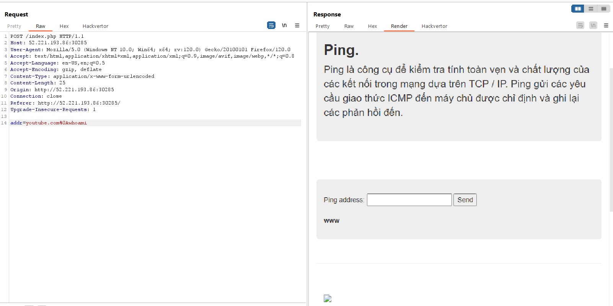
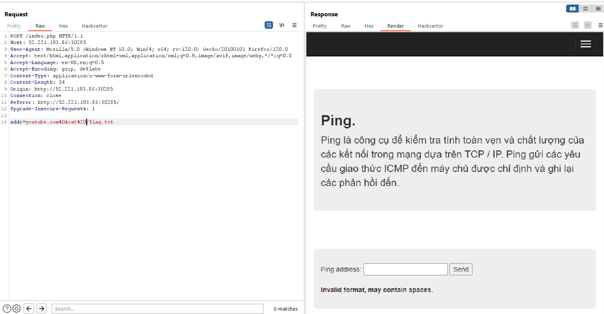
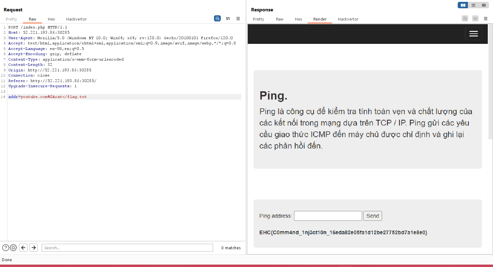

After trying some seperators as `|`, `||`, `&` and `&&`, realizing that the validation has checked these situations.
So we try to using endline to separate the command injection:

Now trying to see the content of `/flag.txt` by using `cat`, but it's an invalid input because of whitespace.

So we using input redirection `<` instead of the whitespace:

Flag: `EHC{C0mm4nd_1nj3ct10n_16eda82e05fa1d12be27752bd7a1e8e0}` 