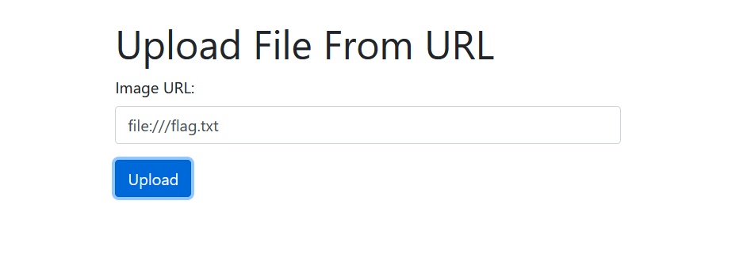
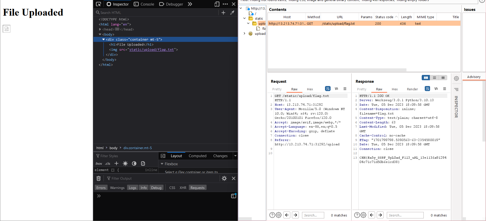

We can see that after uploading an url of image, it was saved and sent back to client.

Using `file://<path_to_file>` to fetch the local file in the system:

And then, we can see the contents of the `flag.txt`:

Flag: `CHH{Ea5y_SSRF_UpL0ad_F1l3_uRL_13e1136a9129404c71c71d50b6e1cd38}`
